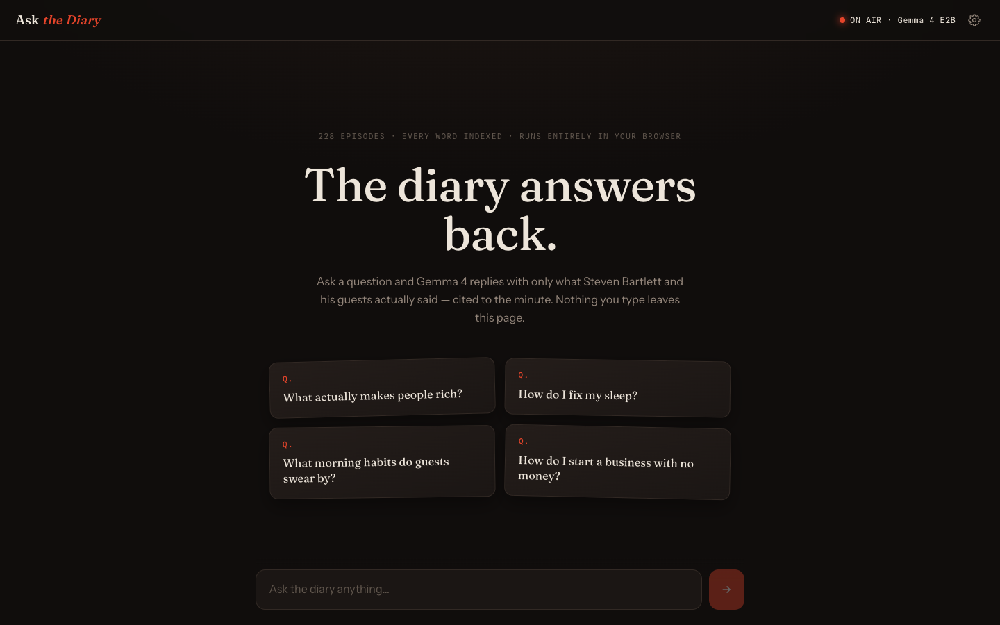
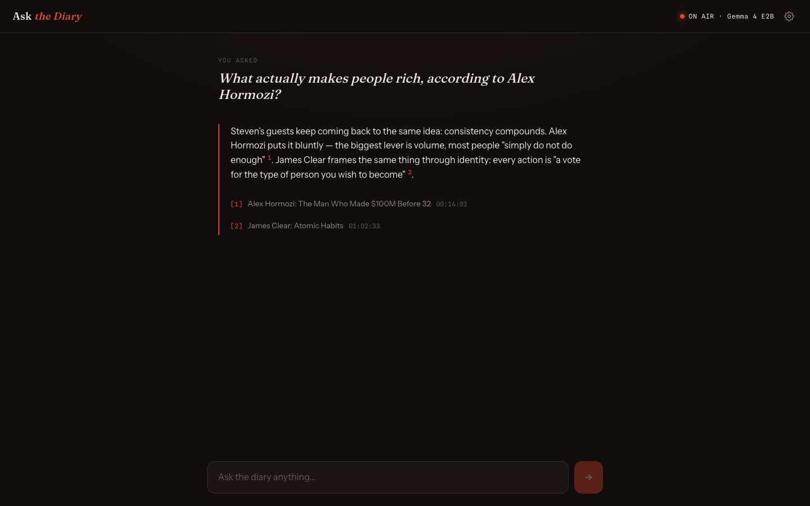

# Ask the Diary

Ask questions, get answers grounded in what Steven Bartlett and his guests actually said on
**The Diary of a CEO** — cited to the minute, running **entirely in your browser**. No server,
no login, no API keys: the LLM, the embeddings, and the search index all live client-side.





## How it works

```
question ──▶ MiniLM embedding (transformers.js, in-browser)
                 │
                 ▼
        cosine top-k over 30,308 int8-quantized chunks   ← 228 scraped episode transcripts
                 │  (11 MB static index, overlap-deduped)
                 ▼
        numbered excerpts + question ──▶ Gemma 4 E2B (LiteRT-LM, WebGPU)
                 │
                 ▼
        streamed answer with [n] citations → episode + timestamp links
```

- **Model** — real [Gemma 4](https://deepmind.google/models/gemma/gemma-4/) `E2B-it` (2.0 GB web
  build) via Google's [LiteRT-LM JS API](https://ai.google.dev/edge/litert-lm/js), running on
  WebGPU. Preferences let you switch to `E4B` (3.0 GB). Phones default to Llama 3.2 1B (0.7 GB)
  on [WebLLM](https://webllm.mlc.ai): mobile browsers kill any page around 1.5–3 GB of memory,
  so the 2 GB models can never finish loading there.
- **First load** — the model downloads once with a live progress bar ("Warming up the studio"),
  streamed chunk-by-chunk into **OPFS** (origin-private file system) so the 2 GB never sits in
  page memory — iOS kills tabs that try. Later visits boot straight from disk (a service worker
  caches the app shell) — the app even works fully offline.
- **RAG** — transcripts for all 228 episodes were scraped from
  [happyscribe](https://podcasts.happyscribe.com/the-diary-of-a-ceo-with-steven-bartlett),
  chunked (~1000 chars, 1-paragraph overlap) and embedded with `all-MiniLM-L6-v2` at build time,
  quantized to int8 (scale-per-row). The browser embeds your question with the same model,
  searches locally, and hands the best excerpts to Gemma with instructions to answer only from
  them and cite `[n]`.

## Develop

```bash
npm install
npm run dev            # app on :5173 — add ?mock=1 to skip the 2 GB download
npx vitest run         # 25 unit tests (chunking, quantized search, dedupe, prompt, rendering)
```

### Rebuild the data (optional)

```bash
node scripts/scrape/scrape.mjs      # scrape transcripts (Playwright + real Chrome)
node scripts/rag/build-index.mjs    # chunk + embed + quantize into static/rag/
node scripts/rag/smoke.mjs "what did the sleep expert say about caffeine?"
```

### Screenshots / E2E

```bash
npm run build && npx vite preview --port 5220
node scripts/shots/shoot.mjs        # design shots (mock mode)
node scripts/shots/e2e-real.mjs     # full run: download Gemma 4, ask, verify offline reload
```

## Requirements

A browser with WebGPU (Chrome/Edge 121+, Safari 26+) and ~2 GB of free storage for the model
cache.

---

Built autonomously by [Claude Code](https://claude.com/claude-code) —
SvelteKit · Svelte 5 runes · LiteRT-LM · transformers.js · Playwright · Vitest.
